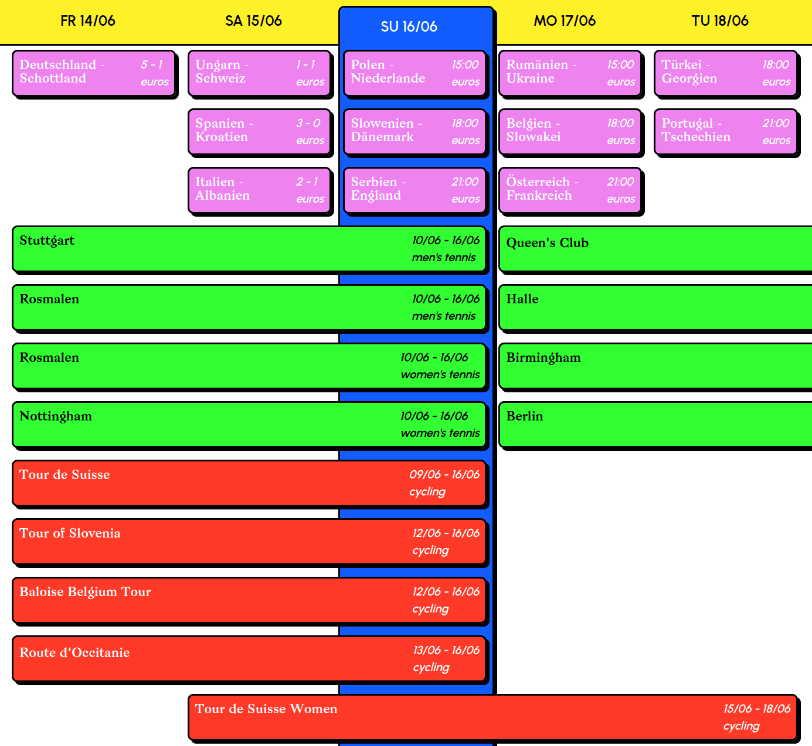

# martcho.uk ludunt
## a web-based app for quickly checking fixtures in cycling, tennis and football

## running

first, install the dependencies with `npm install` and `pip install -r data/requirements.txt`

second, run the python script in `data/scrape.py` to get the latest data from the web (thanks eurosport!)

third, the html site can be served with `npm run dev`
